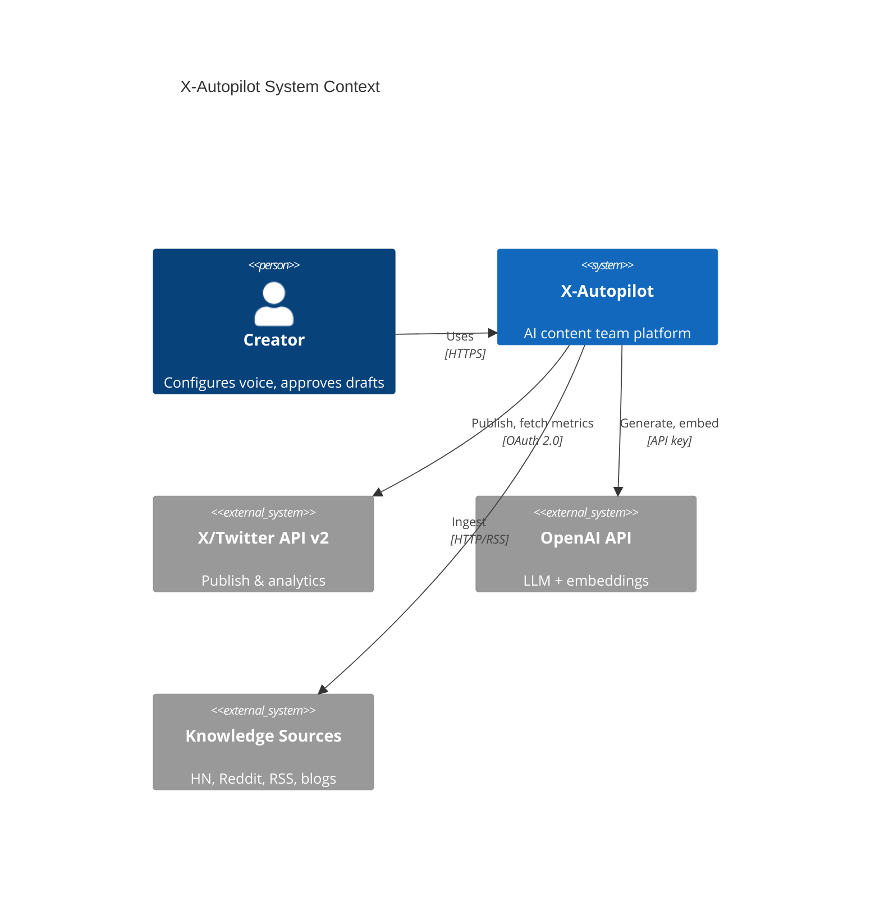
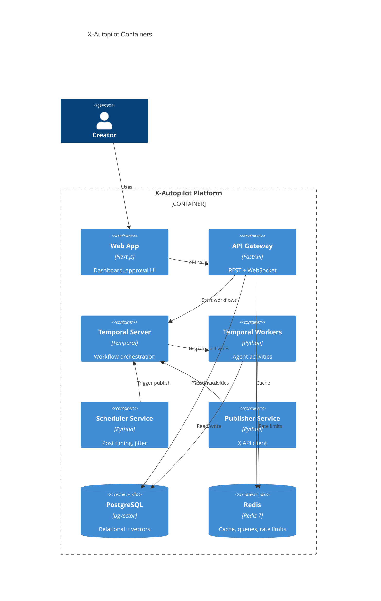

# High-Level Architecture

## System Context



## Container Diagram



## Core Data Flow

```
┌─────────────┐     ┌──────────────┐     ┌─────────────────┐
│  Ingestion  │────▶│  Knowledge   │────▶│  Research Agent │
│  Workers    │     │  Base (RAG)  │     │  (cluster/rank) │
└─────────────┘     └──────────────┘     └────────┬────────┘
                                                   │
                     ┌─────────────────────────────▼──────────────┐
                     │           Content Planner (daily)            │
                     └─────────────────────────────┬──────────────┘
                                                   │
              ┌────────────────────────────────────┼────────────────────┐
              ▼                    ▼               ▼                    ▼
        ┌──────────┐        ┌──────────┐    ┌──────────┐        ┌──────────┐
        │  Tweet   │        │  Thread  │    │  Reply   │        │  Quote   │
        │  Writer  │        │  Writer  │    │  Agent   │        │  Agent   │
        └────┬─────┘        └────┬─────┘    └────┬─────┘        └────┬─────┘
             │                   │               │                    │
             └───────────────────┴───────┬───────┴────────────────────┘
                                         ▼
                              ┌─────────────────────┐
                              │  Quality + Fact     │
                              │  Check + Humanizer  │
                              └──────────┬──────────┘
                                         ▼
                              ┌─────────────────────┐
                              │  Draft (approval)   │
                              └──────────┬──────────┘
                                         ▼
                              ┌─────────────────────┐
                              │  Scheduler + Jitter │
                              └──────────┬──────────┘
                                         ▼
                              ┌─────────────────────┐
                              │  Publisher (X API)  │
                              └──────────┬──────────┘
                                         ▼
                              ┌─────────────────────┐
                              │  Analytics + Learn  │
                              └─────────────────────┘
```

## Service Boundaries

### API Service (FastAPI)

- Authentication (JWT + X OAuth tokens)
- CRUD for profiles, sources, schedules, drafts
- Workflow triggers (manual regenerate, approve)
- WebSocket for real-time draft notifications
- Does NOT run long AI jobs synchronously

### Temporal Workers

All long-running and scheduled work:

| Worker Pool | Responsibilities |
|-------------|------------------|
| `ingestion-worker` | RSS, HN, Reddit fetch, normalize, embed |
| `research-worker` | Cluster, dedupe, rank, extract insights |
| `planning-worker` | Daily content plan generation |
| `generation-worker` | Tweet/thread/reply/quote generation pipeline |
| `analytics-worker` | Fetch X metrics, aggregate, weekly learning |
| `publish-worker` | Scheduled publish, retry, idempotency |

### Scheduler Service

- Maintains posting calendar in Redis sorted sets
- Applies humanization jitter
- Fires Temporal `PublishWorkflow` at computed times
- Handles timezone (user-configured, default from profile)

### Publisher Service

- X API v2 client with OAuth 2.0 user context
- Rate limit tracking per endpoint (Redis token bucket)
- Idempotency keys per draft
- Thread publish as reply chain

## Deployment Topology (MVP)

```
┌─────────────────────────────────────────────────────────┐
│  AWS (single region, e.g. us-east-1)                     │
│                                                         │
│  ┌─────────────┐  ┌─────────────┐  ┌─────────────────┐ │
│  │  ALB        │  │  ECS Fargate │  │  RDS PostgreSQL │ │
│  │             │──│  - api       │  │  (pgvector)     │ │
│  │             │  │  - web       │  └─────────────────┘ │
│  │             │  │  - workers   │  ┌─────────────────┐ │
│  │             │  │  - temporal  │──│  ElastiCache    │ │
│  └─────────────┘  └─────────────┘  │  Redis          │ │
│                                     └─────────────────┘ │
│  ┌─────────────┐  ┌─────────────┐                       │
│  │  S3         │  │  Secrets    │                       │
│  │  (exports)  │  │  Manager    │                       │
│  └─────────────┘  └─────────────┘                       │
└─────────────────────────────────────────────────────────┘
```

## Communication Patterns

| Pattern | Use Case |
|---------|----------|
| Sync REST | CRUD, approvals, config |
| Temporal workflows | Multi-step AI pipelines with retries |
| Redis pub/sub | Real-time draft notifications to WebSocket |
| Polling (X API) | Analytics metrics (no webhook for impressions) |
| Event sourcing (light) | `content_events` table for audit + replay |

## Key Architectural Decisions

### ADR-001: Temporal over Celery

Temporal provides durable execution, visibility UI, and saga patterns for multi-agent pipelines. Celery adds operational complexity without workflow state recovery.

### ADR-002: pgvector over Qdrant (MVP)

Single database reduces ops. pgvector handles <10M vectors fine for personal use. Migrate to Qdrant at SaaS scale if needed.

### ADR-003: FastAPI over NestJS

Python ecosystem alignment with AI/ML libraries (LangChain, OpenAI SDK, sentence-transformers). Single language for workers and API.

### ADR-004: Approval Gate (MVP)

Non-negotiable for trust and safety. Auto-publish as opt-in post-MVP with confidence thresholds.

### ADR-005: Monorepo

Shared types, single CI pipeline, atomic deploys. Split at SaaS scale if team grows.

## Failure Modes

| Failure | Behavior |
|---------|----------|
| OpenAI timeout | Retry 3x with backoff; mark draft `generation_failed` |
| X API 429 | Respect `x-rate-limit-reset`; reschedule publish |
| X API 403 | Disable auto-publish; alert user to re-auth |
| Temporal worker crash | Workflow resumes from last checkpoint |
| DB unavailable | API returns 503; workflows retry activities |
