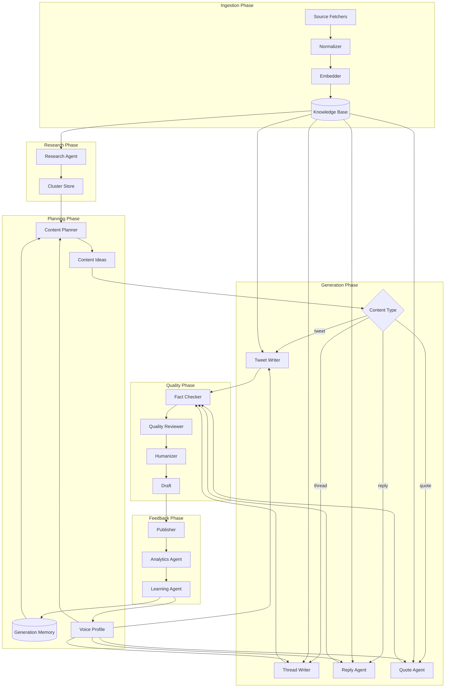

# AI Agent Architecture

## Design Principles

1. **Specialized agents** over one mega-prompt — each agent has narrow responsibility
2. **Structured outputs** — all agents return JSON schemas validated by Pydantic
3. **RAG grounding** — writers must cite knowledge chunk IDs used
4. **Pipeline, not parallel chaos** — sequential stages with clear handoffs
5. **Deterministic scoring** — separate model calls for generation vs. evaluation

## Agent Registry

| Agent | Model | Temp | Purpose |
|-------|-------|------|---------|
| Research Agent | gpt-5.5 | 0.3 | Cluster, extract insights |
| Trend Detection | gpt-5.5-mini | 0.2 | Score topic relevance |
| Content Planner | gpt-5.5 | 0.5 | Daily idea generation |
| Tweet Writer | gpt-5.5 | 0.8 | Generate variations |
| Thread Writer | gpt-5.5 | 0.75 | Multi-tweet narratives |
| Reply Agent | gpt-5.5 | 0.7 | Contextual replies |
| Quote Agent | gpt-5.5 | 0.7 | Unique perspectives |
| Fact Checker | gpt-5.5 | 0.1 | Verify claims against RAG |
| Quality Reviewer | gpt-5.5-mini | 0.2 | Score variations |
| Humanizer | gpt-5.5-mini | 0.9 | Anti-AI polish |
| Analytics Agent | gpt-5.5 | 0.3 | Weekly insights |
| Learning Agent | gpt-5.5 | 0.2 | Update weights |

## Agent Flow Diagram



## Agent Specifications

### Research Agent

**Input:**
```json
{
  "user_id": "uuid",
  "knowledge_items": [{"id", "title", "summary", "published_at"}],
  "voice_profile": { "interests", "expertise" }
}
```

**Output:**
```json
{
  "clusters": [{
    "title": "Redis vs Dragonfly adoption trend",
    "item_ids": ["uuid1", "uuid2"],
    "importance_score": 0.85,
    "insights": ["..."],
    "opinions": ["..."],
    "statistics": [{"claim": "...", "source_id": "..."}],
    "controversies": ["..."],
    "opportunities": ["thread about cache warming strategies"]
  }]
}
```

### Content Planner

**Input:** clusters (top 20), memory (similar past topics), schedule quotas, voice profile.

**Output:** array of content ideas with type, category, hook, rationale, source_cluster_id.

**Constraints enforced in prompt:**
- No topic discussed in last 14 days (check memory)
- Category distribution: max 40% same category per day
- Thread ideas need cluster with ≥3 insights

### Tweet Writer

**Input:** idea, voice profile, RAG context (top 5 chunks), 3 example tweets from user's best performers.

**Output:**
```json
{
  "variations": [{
    "text": "...",
    "hook_type": "contrarian",
    "rag_source_ids": ["chunk_uuid"],
    "char_count": 247
  }]
}
```

Generate exactly 4 variations with different hook types: `question`, `contrarian`, `story`, `statistic`.

### Thread Writer

**Output:**
```json
{
  "variations": [{
    "tweets": [
      {"index": 0, "text": "hook", "role": "hook"},
      {"index": 1, "text": "...", "role": "context"},
      {"index": 5, "text": "...", "role": "takeaway"},
      {"index": 6, "text": "...", "role": "cta"}
    ],
    "tweet_count": 7
  }]
}
```

### Reply Agent

**Input:** target tweet, conversation thread (parent + top 5 replies), voice profile.

**Anti-patterns blocklist checked programmatically:**
- Starts with "Great", "Love this", "This is so"
- Under 40 characters
- Contains only emoji reactions
- No question or new information

### Fact Checker

**Input:** draft text, cited RAG chunks.

**Output:**
```json
{
  "passed": false,
  "issues": [{
    "claim": "Dragonfly is 25x faster than Redis",
    "severity": "high",
    "verdict": "unverified",
    "suggestion": "cite specific benchmark or soften to 'significantly faster in some workloads'"
  }]
}
```

If `severity: high` and `passed: false` → regenerate (max 2 retries).

### Quality Reviewer

Scores 0–1 on weighted rubric:

| Dimension | Weight |
|-----------|--------|
| Hook strength | 0.25 |
| Voice match | 0.25 |
| Authenticity (anti-AI) | 0.20 |
| Technical accuracy | 0.15 |
| Novelty | 0.10 |
| Actionability | 0.05 |

Uses few-shot examples of scored tweets from user's history.

### Humanizer

Applied only to top-scored variant. Transformations:

- Vary sentence length (inject short fragments)
- Add contractions where natural
- Occasional lowercase sentence start (max 1 per tweet)
- Remove AI tells: "In today's", "It's important to note", "Let's dive in"
- Optional typo simulation (disabled by default, `typo_rate: 0`)

**Never humanize facts** — humanizer receives fact-check pass confirmation.

### Learning Agent

**Input:** 30-day analytics, top/bottom posts with content snapshots.

**Output:**
```json
{
  "learned_weights": {
    "category_weights": { "engineering": 1.3, "productivity": 0.7 },
    "hook_preferences": { "contrarian": 1.2, "question": 0.9 },
    "optimal_length_range": [180, 260],
    "best_hours": [9, 13, 19]
  },
  "memory_entries": [{
    "type": "success",
    "summary": "Hot take on database migrations with personal war story",
    "embedding_text": "..."
  }]
}
```

## Agent Communication

Agents do NOT call each other directly. Temporal activities orchestrate:

```python
@activity.defn
async def generate_tweet_draft(idea_id: str) -> DraftResult:
    context = await fetch_rag_context(idea_id)
    variations = await tweet_writer_agent.run(idea_id, context)
    for v in variations:
        v.fact_check = await fact_checker_agent.run(v)
    scored = await quality_reviewer_agent.run(variations)
    best = scored[0]
    if not best.fact_check.passed:
        # retry logic
        ...
    humanized = await humanizer_agent.run(best)
    return save_draft(humanized)
```

## Model Routing

```python
MODEL_CONFIG = {
    "generation": "gpt-5.5",
    "scoring": "gpt-5.5-mini",
    "embedding": "text-embedding-3-small",
    "fallback": "gpt-5.5-mini",  # on rate limit
}
```

## Token Budget per Generation

| Pipeline | Est. Input | Est. Output | Total |
|----------|-----------|-------------|-------|
| Tweet (4 variants) | 3,000 | 800 | ~3,800 |
| Thread (2 variants, 10 tweets) | 5,000 | 2,500 | ~7,500 |
| Reply | 2,500 | 400 | ~2,900 |
| Daily plan | 8,000 | 2,000 | ~10,000 |

## Guardrails (Programmatic)

Beyond prompts:

1. **Char limit** — hard truncate with warning, never publish over limit
2. **Banned phrases** — regex list from voice profile `vocabulary.avoid`
3. **Topic blocklist** — embedding similarity to `never_discuss` topics > 0.85 → reject
4. **Duplicate detection** — cosine similarity to last 30 published > 0.92 → reject
5. **Emoji cap** — enforce `emoji_prefs.max_per_tweet`
