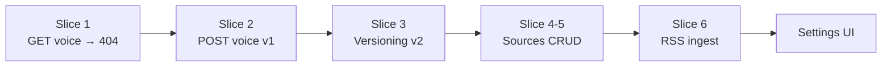

# Milestone 2 — TDD Walkthrough

Milestone 2 teaches your AI **who you are** (voice profile) and **what to read** (knowledge sources + ingestion).

## TDD Slices We Built



| Slice | Test | Behavior |
|-------|------|----------|
| 1 | `test_get_voice_profile_returns_404_when_none` | No profile yet → 404 |
| 2 | `test_create_voice_profile_returns_version_one` | First save → v1 active |
| 3 | `test_new_voice_profile_increments_version...` | Re-save → v2, v1 deactivated |
| 4 | `test_list_sources_empty` | No sources → `[]` |
| 5 | `test_create_rss_source` | Add RSS feed |
| 6 | `test_fetch_source_ingests_items` | Fetch → articles in knowledge base |
| 6b | `test_fetch_source_deduplicates` | Same article twice → skip |

**16 tests total** (7 from M1 + 9 from M2).

---

## The Big Picture

```
┌─────────────────────────────────────────────────────────────────┐
│                         YOU (Creator)                            │
└────────────┬───────────────────────────────┬────────────────────┘
             │ Voice Profile                  │ Knowledge Sources
             ▼                                ▼
    ┌─────────────────┐              ┌─────────────────┐
    │ voice_profiles  │              │ knowledge_sources│
    │ (versioned)     │              │ (RSS, HN, ...)   │
    └────────┬────────┘              └────────┬─────────┘
             │                                │ fetch
             │ used by AI (M3)                ▼
             │                       ┌─────────────────┐
             │                       │ knowledge_items │
             │                       │ (articles)      │
             └───────────────────────┴─────────────────┘
```

---

## Slice 1–3: Voice Profile

### Picture: Versioned voice

```
Save #1 → voice_profiles: { version: 1, is_active: true }
Save #2 → voice_profiles: { version: 1, is_active: false }
                        { version: 2, is_active: true }  ← AI uses this
```

### Why versioning?

When you tweak your tone, we keep history. The AI always uses `is_active = true`. Learning loop (M6) can compare what worked across versions.

### Test (Slice 2)

```python
async def test_create_voice_profile_returns_version_one(client):
    token = await register_and_login(client)
    response = await client.post(
        "/v1/profile/voice",
        json=SAMPLE_VOICE_PROFILE,
        headers=auth_headers(token),
    )
    assert response.status_code == 201
    assert response.json()["version"] == 1
```

### API

| Method | Path | Auth | Description |
|--------|------|------|-------------|
| GET | `/v1/profile/voice` | ✅ | Active profile or 404 |
| POST | `/v1/profile/voice` | ✅ | Create new version |

### Layers

```
POST /v1/profile/voice
    → routers/profile.py      (HTTP)
    → services/voice_profile_service.py  (deactivate old, increment version)
    → models/voice_profile.py (DB table)
```

---

## Slice 4–5: Knowledge Sources

### Picture

```
POST /v1/sources { name, source_type: "rss", config: { url } }
    → knowledge_sources table

GET /v1/sources → [{ id, name, url, ... }]
```

### Test

```python
async def test_create_rss_source(client):
    response = await client.post("/v1/sources", json={
        "source_type": "rss",
        "name": "Hacker News Frontpage",
        "config": {"url": "https://hnrss.org/frontpage"},
    }, headers=auth_headers(token))
    assert response.status_code == 201
```

---

## Slice 6: RSS Ingestion

### Picture

```
POST /v1/sources/{id}/fetch
        │
        ▼
   fetch RSS URL (feedparser)
        │
        ▼
   normalize each entry
        │
        ▼
   dedupe by external_id (sha256 of URL)
        │
        ▼
   INSERT into knowledge_items
        │
        ▼
   { items_ingested: 12, items_skipped: 3 }
```

### Deduplication

```python
external_id = sha256(url or title)
# UNIQUE (user_id, external_id) in DB
# Second fetch of same article → skipped
```

### Test uses mock (TDD best practice)

We mock `fetch_rss_items` so tests don't hit the real internet:

```python
with patch("xautopilot.services.ingestion_service.fetch_rss_items", ...):
    response = await client.post(f"/v1/sources/{source_id}/fetch", ...)
```

The test verifies **behavior through the public API** — not feedparser internals.

---

## Database Migration

```bash
cd apps/api && alembic upgrade head
```

Creates:
- `voice_profiles`
- `knowledge_sources`
- `knowledge_items`

---

## Frontend

| Page | Path | What it does |
|------|------|--------------|
| Voice Profile | `/settings/profile` | Edit profession, topics, tone |
| Sources | `/settings/sources` | Add RSS, click "Fetch now", see articles |
| Dashboard | `/dashboard` | Shows profile/sources/article counts |

---

## Run It

```bash
# If you haven't since M1:
./scripts/setup.sh
cd apps/api && alembic upgrade head   # adds M2 tables

# API + Web
uvicorn xautopilot.main:app --reload
npm run dev  # in apps/web

# Tests
pytest tests/ -v
```

### Try the flow

1. Log in → Dashboard
2. **Voice Profile** → fill in topics/tone → Save
3. **Sources** → add `https://hnrss.org/frontpage` → **Fetch now**
4. See ingested articles appear below

---

## What's Next (Milestone 3)

```
knowledge_items → chunk → embed → RAG
                              ↓
                    Content Planner → Tweet Generator
```

Same TDD approach: one slice at a time.
