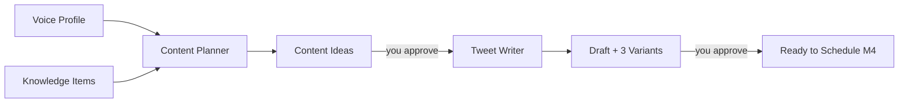

# Milestone 3 — TDD Walkthrough

Milestone 3 is where X-Autopilot becomes an **AI content team**: it plans what to post, writes tweets, and waits for your approval.

## The Full Pipeline (M3)



## TDD Slices

| Slice | Test | Behavior |
|-------|------|----------|
| 1 | `test_get_today_plan_returns_404_when_none` | No plan yet → 404 |
| 2 | `test_generate_plan_creates_tweet_ideas` | Plan with 3 tweet ideas |
| 3 | `test_approve_idea` | PATCH idea → approved |
| 4 | `test_generate_draft_requires_approved_idea` | Can't draft unapproved idea |
| 5 | `test_generate_draft_creates_variants` | 3 scored tweet variants |
| 6 | `test_list_ready_drafts` | List drafts by status |
| 7 | `test_approve_draft` | Pick variant + approve |

**24 tests total** (16 from M1+M2 + 8 new).

---

## Slice 1–2: Content Planner

### Picture

```
POST /v1/plans/generate
        │
        ├─ read voice profile (topics, profession)
        ├─ read knowledge_items (recent articles)
        │
        ▼
   Content Planner Agent
        │
        ▼
   3 tweet ideas saved to content_ideas
```

### Test

```python
async def test_generate_plan_creates_tweet_ideas(client):
    await setup_voice_profile(client)
    response = await client.post("/v1/plans/generate", headers=headers)
    assert len(response.json()["ideas"]) == 3
```

### Agent code (`services/agents/content_planner.py`)

```python
async def plan_daily_content(profession, interests, knowledge_titles):
    # Uses your topics + article titles to propose ideas
    # Production: replace with OpenAI gpt-5.5 + RAG
```

---

## Slice 3: Approve Ideas (Human in the Loop)

```
You: "Yes, I want to post about this"  →  idea.status = "approved"
You: "No"                               →  idea.status = "rejected"
```

**Why?** You stay in control. The AI proposes; you decide.

```python
PATCH /v1/plans/{plan_id}/ideas/{idea_id}
{ "status": "approved" }
```

---

## Slice 4–5: Tweet Writer

### Picture

```
Approved Idea
     │
     ▼
Tweet Writer Agent  →  4 variations (MVP: 3)
     │
     ▼
Quality scoring  →  sort by overall score
     │
     ▼
draft_variants table
```

### Test

```python
async def test_generate_draft_creates_variants(client):
    response = await client.post("/v1/drafts/generate", json={"idea_id": ...})
    body = response.json()
    assert len(body["variants"]) == 3
    assert body["variants"][0]["scores"]["overall"] >= body["variants"][1]["scores"]["overall"]
```

### Guardrails built in

- Respects `vocabulary.avoid` from voice profile
- Max 280 characters
- Variants use different hook types: question, contrarian, story

---

## Slice 6–7: Draft Approval

```
GET /v1/drafts?status=ready   →  see all pending tweets
PATCH /v1/drafts/{id}       →  approve best variant
```

States: `generating → ready → approved`

---

## Database (Migration 0003)

```
content_plans  ──1:N──▶  content_ideas  ──1:1──▶  drafts  ──1:N──▶  draft_variants
```

```bash
cd apps/api && alembic upgrade head
```

---

## API Summary

| Method | Path | Purpose |
|--------|------|---------|
| GET | `/v1/plans/today` | Today's plan |
| POST | `/v1/plans/generate` | AI generates ideas |
| PATCH | `/v1/plans/{id}/ideas/{id}` | Approve/reject idea |
| POST | `/v1/drafts/generate` | Write tweet from idea |
| GET | `/v1/drafts` | List drafts |
| PATCH | `/v1/drafts/{id}` | Approve draft |

---

## UI Pages

| Page | Path | Actions |
|------|------|---------|
| Content Plan | `/dashboard/plan` | Generate, approve ideas, create drafts |
| Drafts | `/dashboard/drafts` | Review variants, approve best |

---

## Try the Full Flow

1. **Voice Profile** → save your topics/tone
2. **Sources** → fetch HN RSS articles
3. **Content Plan** → Generate today's plan
4. **Approve** an idea you like
5. **Generate draft** → see 3 tweet variations
6. **Drafts** → Approve the best one

---

## What's Next (Milestone 4)

```
approved draft  →  scheduler  →  publish to X
```

Same TDD: one slice at a time.

## Agent Architecture (swap-ready)

```
services/agents/
  content_planner.py   ← MVP: templates, prod: OpenAI
  tweet_writer.py      ← MVP: templates, prod: OpenAI + humanizer
```

Tests mock at the **service boundary** when needed; most M3 tests use real agents (deterministic templates) — still testing public API behavior.
