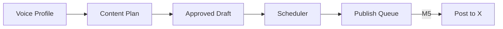

# Milestone 4 — TDD Walkthrough

Milestone 4 adds **scheduling**: approved drafts get a human-like posting time, and you can see what's queued to go live.

## Where M4 Fits in the Pipeline



**Before M4:** draft status stops at `approved`.  
**After M4:** draft moves to `scheduled` with a `scheduled_at` timestamp.

---

## The Scheduling Mental Model

Think of your day as **three posting windows** (morning, afternoon, evening). When you click "Schedule", the system:

1. Picks a window with the fewest posts already booked
2. Rolls a random time inside that window
3. Adds jitter (so you don't always post at `:00`)
4. De-rounds (avoids exactly `:00` and `:30`)
5. Bumps forward if another post is within 20 minutes

```
  09:00 ─────────────── 09:45     13:00 ─── 13:45     19:00 ─── 19:45
    │    ★ draft 1 @ 9:12           │                     │
    │              ★ draft 2 @ 9:37  (≥20 min later)      │
```

---

## TDD Slices (Vertical)

| Slice | Test | What it proves |
|-------|------|----------------|
| 1 | `test_get_schedule_returns_defaults` | New user gets 3 windows, jitter 15 |
| 2 | `test_update_schedule` | PUT changes tweets/day & jitter |
| 3 | `test_schedule_approved_draft` | Approved → scheduled + future time |
| 4 | `test_publish_queue_lists_scheduled_draft` | Queue shows preview text |
| 5 | `test_cancel_schedule_reverts_to_approved` | DELETE un-schedules |
| 6 | `test_two_scheduled_drafts_are_at_least_20_minutes_apart` | Collision avoidance |

**30 tests total** (24 from M1–M3 + 6 new).

---

## Slice 1: Default Schedule

### Picture

```
GET /v1/schedule
      │
      ▼
  No row yet?  ──yes──▶  create Schedule with DEFAULT_WINDOWS
      │
      no
      ▼
  return config (3 tweets/day, 3 windows)
```

### Test

```python
async def test_get_schedule_returns_defaults(client):
    response = await client.get("/v1/schedule", headers=headers)
    assert response.json()["tweets_per_day"] == 3
    assert len(response.json()["posting_windows"]) == 3
```

### Code (`models/schedule.py`)

```python
DEFAULT_WINDOWS = [
    {"start": "09:00", "end": "09:45", "days": [1..7]},
    {"start": "13:00", "end": "13:45", "days": [1..7]},
    {"start": "19:00", "end": "19:45", "days": [1..7]},
]
```

---

## Slice 2: Update Schedule

```
PUT /v1/schedule { tweets_per_day: 5, jitter_minutes: 10 }
        │
        ▼
   schedule.tweets_per_day = 5
   schedule.jitter_minutes = 10
```

Human-like posting needs **jitter** — without it every tweet lands at 9:00:00.

---

## Slice 3: Schedule an Approved Draft

### Picture

```
POST /v1/drafts/{id}/schedule
        │
        ├─ draft.status == "approved"?  (else 400)
        ├─ load user's Schedule config
        ├─ load occupied slots (other scheduled drafts)
        │
        ▼
   Slot Allocator  ──▶  human-like datetime
        │
        ▼
   draft.status = "scheduled"
   draft.scheduled_at = slot
```

### Test

```python
async def test_schedule_approved_draft(client):
    response = await client.post(f"/v1/drafts/{draft_id}/schedule", ...)
    assert response.json()["status"] == "scheduled"
    assert scheduled_at > now()
```

### Slot Allocator (`services/slot_allocator.py`)

| Step | Function | Purpose |
|------|----------|---------|
| 1 | `_random_time_in_window` | Pick time in 9:00–9:45 |
| 2 | jitter | ±N minutes random offset |
| 3 | `avoid_collisions` | Stay ≥20 min from other posts |
| 4 | `de_round_time` | Nudge off :00 / :30 |
| 5 | `avoid_collisions` again | De-round can't break the gap |

When posts already exist, the allocator anchors after the **latest occupied slot + 20 min** instead of picking a random time that might collide.

---

## Slice 4: Publish Queue

```
GET /v1/publish/queue
        │
        ▼
  SELECT drafts WHERE status='scheduled'
  ORDER BY scheduled_at ASC
        │
        ▼
  [{ draft_id, preview_text, scheduled_at, ... }]
```

The queue is your **calendar view** — what will go live and when. M5 will poll this and publish to X.

---

## Slice 5: Cancel Schedule

```
DELETE /v1/drafts/{id}/schedule
        │
        ▼
   draft.status = "approved"
   draft.scheduled_at = null
```

You can reschedule later without regenerating the tweet.

---

## Slice 6: Collision Avoidance

### Why this test exists

Two approved drafts scheduled back-to-back must not land 50 seconds apart — that looks like a bot.

### Fix (learned during RED)

```
WRONG order:
  avoid → de_round   (de-round can undo the gap!)

RIGHT order:
  avoid → de_round → avoid

PLUS when occupied slots exist:
  slot = max(occupied) + 20 minutes  (deterministic anchor)
```

---

## New API Endpoints

| Method | Path | Description |
|--------|------|-------------|
| GET | `/v1/schedule` | Read schedule config |
| PUT | `/v1/schedule` | Update quotas & jitter |
| POST | `/v1/drafts/{id}/schedule` | Schedule approved draft |
| DELETE | `/v1/drafts/{id}/schedule` | Cancel schedule |
| GET | `/v1/publish/queue` | List upcoming posts |

---

## Database (Migration `0004`)

```
schedules          drafts (new column)
─────────          ──────────────────
user_id (unique)   scheduled_at (timestamptz)
posting_windows    status can be "scheduled"
jitter_minutes
tweets_per_day
```

Run after pulling:

```bash
cd apps/api && alembic upgrade head
```

---

## UI Added

| Page | Path | Purpose |
|------|------|---------|
| Schedule settings | `/settings/schedule` | Quotas, jitter, window preview |
| Publish queue | `/dashboard/schedule` | Upcoming posts + cancel |
| Drafts (updated) | `/dashboard/drafts` | Schedule / Cancel buttons |

---

## Run Tests

```bash
cd apps/api && pytest tests/ -v
# 30 passed
```

---

## What's Next (M5)

M5 connects to the **X API** and publishes queued drafts at `scheduled_at`. The queue you built in M4 becomes the work list for the publisher.
