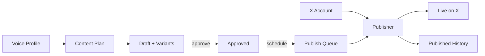

# Milestone 5 — TDD Walkthrough

Milestone 5 closes the loop: **approved + scheduled drafts publish to X**.

## Full Pipeline (M1 → M5)



---

## TDD Slices

| Slice | Test | Behavior |
|-------|------|----------|
| 1 | `test_get_x_account_returns_not_connected` | No account → 404 |
| 2 | `test_connect_x_account` | Mock connect stores encrypted tokens |
| 3 | `test_publish_requires_connected_x_account` | Can't publish without X |
| 4 | `test_publish_scheduled_draft` | Posts tweet, status → published |
| 5 | `test_published_post_appears_in_history` | History lists live posts |
| 6 | `test_publish_same_draft_twice_is_idempotent` | Second call returns same tweet ID |

**36 tests total** (30 from M1–M4 + 6 new).

---

## Slice 1–2: X Account Connection

### Picture

```
You                    API                     Database
 │                      │                         │
 │── GET /v1/x/account ─▶│── query x_accounts ────▶│ (empty)
 │◀── 404 not connected ─│                         │
 │                      │                         │
 │── POST /connect ─────▶│── encrypt tokens ───────▶│ x_accounts row
 │◀── @{handle} ─────────│                         │
```

### Why mock mode first?

Real X OAuth (PKCE) needs client ID, callback URL, and user consent. For TDD we use **`X_API_MODE=mock`** (default) so tests hit the real HTTP API without calling Twitter.

### Test (slice 2)

```python
async def test_connect_x_account(client):
    response = await client.post("/v1/x/account/connect", json={"handle": "testcreator"}, ...)
    assert response.json()["handle"] == "testcreator"
```

### Token encryption (`services/crypto_service.py`)

```
plain access_token  →  Fernet encrypt  →  BYTEA in x_accounts
```

Tokens never stored in plaintext — even in dev.

---

## Slice 3–4: Publish a Draft

### Picture

```
POST /v1/publish/{draft_id}
        │
        ├─ X account connected?     ──no──▶ 400
        ├─ draft scheduled/approved? ──no──▶ 400
        ├─ already published?       ──yes─▶ return existing (idempotent)
        │
        ▼
   X Client.post_tweet(text)
        │
        ▼
   published_posts row + draft.status = "published"
```

### X Client boundary (`services/x_client.py`)

```
┌─────────────────────────────────────┐
│  twitter_publish_service            │  ← business logic
│         │                           │
│         ▼                           │
│  XClient protocol                   │  ← swappable boundary
│    ├─ MockXClient  (tests/dev)     │
│    └─ LiveXClient  (production)     │
└─────────────────────────────────────┘
```

Tests exercise **real HTTP** through FastAPI; only the external X API is faked via `MockXClient`.

### Test (slice 4)

```python
async def test_publish_scheduled_draft(client):
    headers, draft_id = await create_scheduled_draft(client)
    await connect_x_account(client, headers)
    response = await client.post(f"/v1/publish/{draft_id}", headers=headers)
    assert response.json()["status"] == "published"
    assert response.json()["x_tweet_id"]
```

### Publish service (`services/twitter_publish_service.py`)

Key behaviors:
- Validates tweet ≤ 280 chars
- Snapshots content at publish time (`content_snapshot` JSON)
- Sets `draft.status = "published"`

---

## Slice 5: Published History

```
GET /v1/publish/history
        │
        ▼
  published_posts ORDER BY published_at DESC
```

This table feeds **M6 analytics** (impressions, likes, etc.).

---

## Slice 6: Idempotency

```
POST /publish/{id}  ──first──▶  creates post, tweet_id=123
POST /publish/{id}  ──again──▶  returns same post, tweet_id=123
```

Prevents double-posting if the user clicks "Publish now" twice or a worker retries.

Unique constraints enforce this at the DB level:
- `published_posts.draft_id` UNIQUE
- `published_posts.x_tweet_id` UNIQUE

---

## New API Endpoints

| Method | Path | Description |
|--------|------|-------------|
| GET | `/v1/x/account` | Connection status |
| POST | `/v1/x/account/connect` | Mock connect (dev) |
| POST | `/v1/publish/{draft_id}` | Publish now |
| GET | `/v1/publish/history` | Past posts |

---

## Database (Migration `0005`)

```
x_accounts                 published_posts
──────────                 ───────────────
user_id (unique)           draft_id (unique)
handle                     x_tweet_id (unique)
access_token_enc (BYTEA)   content_snapshot (JSON)
refresh_token_enc          preview_text
scopes                     published_at
```

```bash
cd apps/api && alembic upgrade head
```

---

## UI Added

| Page | Path | Purpose |
|------|------|---------|
| X Account | `/settings/x` | Connect mock X account |
| Publish Queue | `/dashboard/schedule` | **Publish now** button |
| Published | `/dashboard/history` | Live posts + tweet IDs |

---

## Try the Full Loop

1. Voice profile → generate plan → approve idea → generate draft → approve
2. Schedule draft → **Settings → X Account** → connect handle
3. **Publish Queue** → **Publish now**
4. Check **Published** for tweet ID

---

## Configuration

| Env var | Default | Meaning |
|---------|---------|---------|
| `X_API_MODE` | `mock` | Use `MockXClient` (no real X calls) |
| `X_API_MODE` | `live` | Call `api.twitter.com/2/tweets` |
| `SECRET_KEY` | dev | Fernet key for token encryption |

---

## What's Next (M6)

M6 fetches **engagement metrics** for each `x_tweet_id` in `published_posts` and builds the analytics dashboard.
