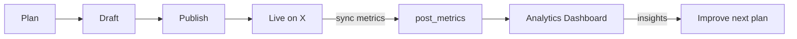

# Milestone 6 — TDD Walkthrough

Milestone 6 adds **analytics**: track engagement on published posts and learn what works.

## The Complete MVP Loop (M1 → M6)



---

## TDD Slices

| Slice | Test | Behavior |
|-------|------|----------|
| 1 | `test_analytics_overview_empty` | No posts → zeros |
| 2 | `test_sync_post_metrics` | Pull metrics from X, store snapshot |
| 3 | `test_analytics_overview_reflects_synced_metrics` | Overview aggregates impressions |
| 4 | `test_analytics_posts_leaderboard` | List posts with latest metrics |
| 5 | `test_analytics_insights_when_posts_exist` | Weekly learning summary |

**41 tests total** (36 from M1–M5 + 5 new).

---

## Slice 1: Empty Overview

### Picture

```
GET /v1/analytics/overview?period=7d
        │
        ▼
  count published_posts in last 7 days → 0
        │
        ▼
  { posts_published: 0, total_impressions: 0, top_post: null }
```

### Test

```python
async def test_analytics_overview_empty(client):
    response = await client.get("/v1/analytics/overview?period=7d", ...)
    assert response.json()["posts_published"] == 0
```

---

## Slice 2: Sync Metrics from X

### Picture

```
POST /v1/analytics/posts/{post_id}/sync
        │
        ├─ load published_post (x_tweet_id)
        ├─ decrypt X access token
        │
        ▼
   XClient.get_tweet_metrics(tweet_id)
        │
        ▼
   calculate engagement_rate
        │
        ▼
   INSERT post_metrics snapshot
```

### Engagement rate formula

```
engagements = likes + replies + reposts + bookmarks + quotes
engagement_rate = engagements / impressions   (0 if impressions = 0)
```

### Test

```python
async def test_sync_post_metrics(client):
    headers, published = await create_published_post(client)
    response = await client.post(f"/v1/analytics/posts/{published['id']}/sync", ...)
    assert response.json()["impressions"] > 0
```

### X Client extension (`services/x_client.py`)

```
MockXClient.get_tweet_metrics  →  deterministic fake numbers (tests)
LiveXClient.get_tweet_metrics  →  GET /2/tweets/{id}?tweet.fields=public_metrics
```

---

## Slice 3: Overview With Data

```
published_posts (1)  +  post_metrics (latest)
        │
        ▼
  total_impressions = sum(impressions)
  avg_engagement_rate = mean(rates)
  top_post = highest engagement_rate
```

After one sync, overview shows real numbers — not zeros.

---

## Slice 4: Post Leaderboard

```
GET /v1/analytics/posts?period=30d
        │
        ▼
  [{ post_id, preview_text, metrics: { impressions, likes, ER } }]
```

Sorted by `published_at` desc. Posts without synced metrics show `metrics: null` and a **Sync** button in the UI.

---

## Slice 5: Weekly Insights

```
GET /v1/analytics/insights
        │
        ▼
  Analytics agent (MVP: rule-based)
    ├─ best post by engagement_rate
    ├─ worst post (if ER < 2%)
    └─ recommended_adjustments (increase/decrease category weights)
```

Production will replace this with an LLM Learning Agent; the API shape stays the same.

---

## New API Endpoints

| Method | Path | Description |
|--------|------|-------------|
| GET | `/v1/analytics/overview?period=7d` | Summary stats |
| GET | `/v1/analytics/posts?period=30d` | Post leaderboard |
| POST | `/v1/analytics/posts/{id}/sync` | Fetch + store metrics |
| GET | `/v1/analytics/insights` | Weekly learning report |

---

## Database (Migration `0006`)

```
published_posts          post_metrics (time-series)
───────────────          ─────────────────────────
id ◀──────────────────── post_id
x_tweet_id               impressions, likes, replies...
                         engagement_rate
                         captured_at  (+1h, +6h, +24h in prod)
```

```bash
cd apps/api && alembic upgrade head
```

---

## UI Added

| Page | Path | Purpose |
|------|------|---------|
| Analytics | `/dashboard/analytics` | Overview cards, insights, sync per post |

---

## Try the Full MVP Loop

1. Plan → draft → approve → schedule → publish (M3–M5)
2. **Analytics** → **Sync metrics** on a published post
3. See impressions, engagement rate, and weekly insights

---

## What's Next (Post-MVP)

- Temporal `MetricsCollectionWorkflow` (auto-sync at +1h, +6h, +24h)
- Follower growth chart (`follower_snapshots`)
- Posting time heatmap
- LLM-powered Learning Agent feeding back into Content Planner
